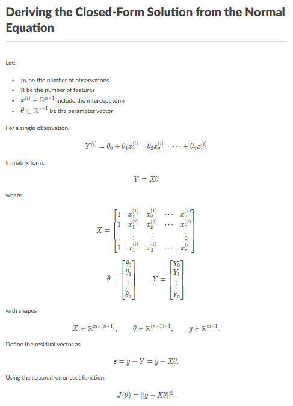
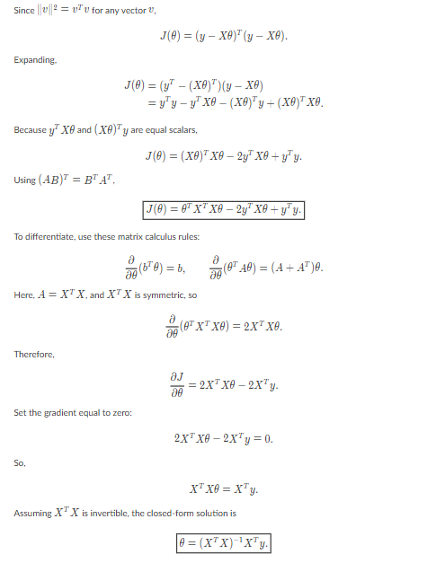

# Linear Regression From Scratch

A from-scratch implementation of simple and multiple linear regression using NumPy, Pandas, and Matplotlib that demonstrates the mathematical foundations of machine learning without relying on scikit-learn or similar libraries.

## Project Structure

- **load_dataset.py** - Downloads `Salary_Data.csv` from Kaggle into `datasets/` when the file is missing
- **models.py** - Core `SimpleLinearRegression` and `MultiLinearRegression` classes with closed-form solution implementations
- **preprocessing.py** - Specialized `SalaryDataPreprocessor` designed to handle target encoding and safe categorical variable mapping
- **toolkit.py** - Utility classes (`ModelMetrics`, `DatasetKit`, `StatKit`) for evaluation metrics, matrix combinations, and stat operations
- **salary.ipynb** - Walkthrough notebook featuring simple linear regression (single variable)
- **salary-multi.ipynb** - Complete end-to-end multiple linear regression tracking data splitting, multicollinearity profiling, and scoring
- **datasets/** - Contains Salary_Data.csv from [Kaggle](https://www.kaggle.com/datasets/mohithsairamreddy/salary-data)

## Setup

Create and activate a virtual environment:

| Windows | Linux/macOS |
|---|---|
| `python -m venv .venv`<br>`.venv\Scripts\activate` | `python3 -m venv .venv`<br>`source .venv/bin/activate` |

Install dependencies:
```bash
pip install -r requirements.txt
```

If you add a new dependency, update `requirements.txt` before pushing:
```bash
pip freeze > requirements.txt
```

## Usage

If `datasets/Salary_Data.csv` is not present yet, run:
```bash
python load_dataset.py
```

Why this step matters:
- Both notebooks expect a local copy of `datasets/Salary_Data.csv`
- `load_dataset.py` downloads the Kaggle dataset once, moves the CSV into the expected folder, and prints a quick preview so you can confirm the file loaded correctly
- If the CSV already exists locally, the script detects that and skips the download

The main analysis is explored in two focal notebooks:

1. **[salary.ipynb](salary.ipynb) (Simple Linear Regression)**
   - Data loading, cleaning, and manual subset splitting
   - Model training using purely *years of experience* to predict salary
   - K-fold cross validation algorithms
   - Visualizations and metrics interpretations

2. **[salary-multi.ipynb](salary-multi.ipynb) (Multiple Linear Regression)**
   - Handling dynamic properties via custom modular `preprocessing.py`
   - Rare-category target encoding `Job Title`, mapping ordinal `Education`/`Gender` limits
   - Correlation matrices/heatmaps analyzing feature multicollinearity 
   - Multi-covariate modeling against baseline targets compared successfully against `Scikit-Learn`

## Implementation Details

### Simple Linear Regression
The `SimpleLinearRegression` class uses the closed-form least squares solution:

$$b_0 = \frac{ \Sigma{y}\Sigma{x^2} - \Sigma{x}\Sigma{xy} }{ n\Sigma{x^2} - (\Sigma{x})^2 }$$

$$b_1 = \frac{ n\Sigma{xy} - \Sigma{x}\Sigma{y} }{ n\Sigma{x^2} - (\Sigma{x})^2 }$$

### Multiple Linear Regression
The `MultiLinearRegression` leverages scalable matrix calculus to model independent features using the **Normal Equation**:

$$\theta = (X^T X)^{-1} X^T y$$

*(Where $X$ is the dynamically mapped feature design matrix, and $\theta$ is the optimal parameter vector calculation natively supporting dynamic independent bias/intercept prepending).*

Both of the above math deployments provide deterministic analytical solutions mathematically resolving parameters instantly, skipping any need to introduce iterative optimization logic like gradient descent.

## Evaluation Metrics

The `ModelKit` class provides:
- Mean Absolute Error (MAE)
- Mean Absolute Percentage Error (MAPE)  
- Root Mean Squared Error (RMSE)
- R-squared (coefficient of determination)

## Quick Proof

A quick proof of mine for how, fundamentally and mathematically, a linear regression works (how the parameters are calculated):


