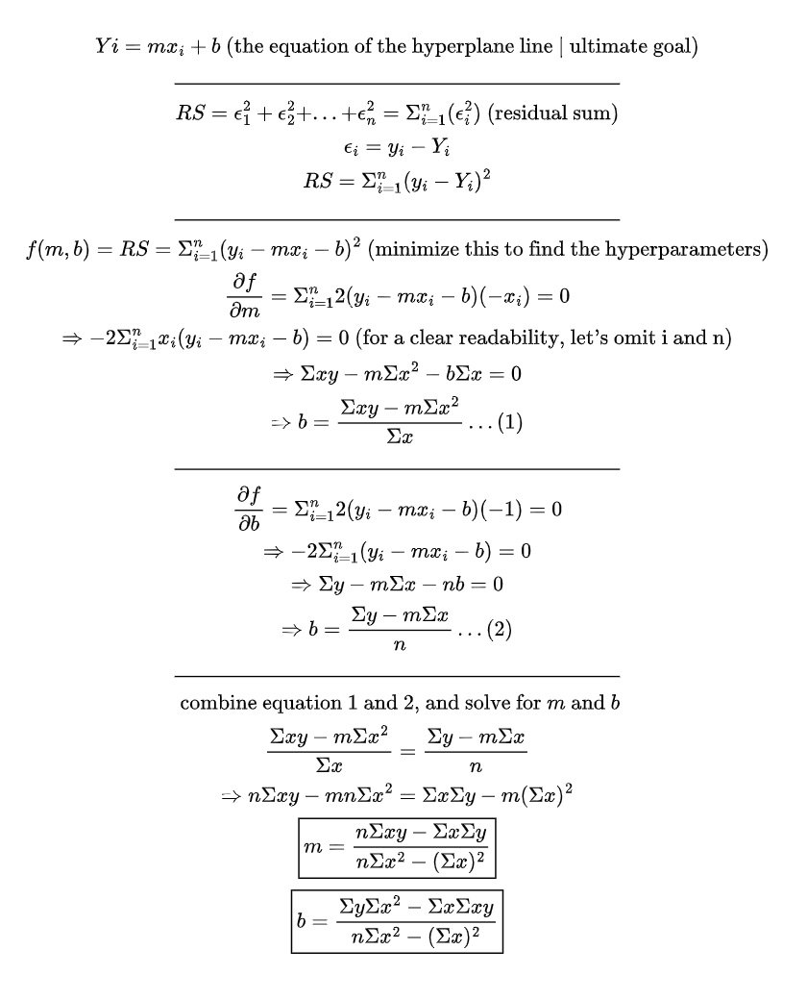

# Linear Regression From Scratch

A from-scratch implementation of simple linear regression using NumPy, Pandas, and Matplotlib that demonstrates the mathematical foundations of machine learning without relying on scikit-learn or similar libraries.

## Project Structure

- **load_dataset.py** - Downloads `Salary_Data.csv` from Kaggle into `datasets/` when the file is missing
- **models.py** - Core `SimpleLinearRegression` class with closed-form solution implementation
- **toolkit.py** - Utility classes (`ModelKit`, `StatKit`) for evaluation metrics and data operations
- **salary.ipynb** - Full walkthrough notebook with explanations, visualizations, and analysis
- **datasets/** - Contains Salary_Data.csv from [Kaggle](https://www.kaggle.com/datasets/mohithsairamreddy/salary-data)

## Setup

Create and activate a virtual environment:

| Windows | Linux/macOS |
|---|---|
| `python -m venv .venv`<br>`.venv\Scripts\activate` | `python3 -m venv .venv`<br>`source .venv/bin/activate` |

Install dependencies:
```bash
pip install -r requirements.txt
```

If you add a new dependency, update `requirements.txt` before pushing:
```bash
pip freeze > requirements.txt
```

## Usage

If `datasets/Salary_Data.csv` is not present yet, run:
```bash
python load_dataset.py
```

Why this step matters:
- `salary.ipynb` expects a local copy of `datasets/Salary_Data.csv`
- `load_dataset.py` downloads the Kaggle dataset once, moves the CSV into the expected folder, and prints a quick preview so you can confirm the file loaded correctly
- If the CSV already exists locally, the script detects that and skips the download

The main analysis is in [salary.ipynb](salary.ipynb), which includes:
- Data loading, cleaning, and splitting
- Model training using years of experience to predict salary
- K-fold cross validation
- Performance evaluation (MAE, MAPE, RMSE, R²)
- Visualizations and interpretations

## Implementation Details

The `SimpleLinearRegression` class uses the closed-form least squares solution:

$$b_0 = \frac{ \Sigma{y}\Sigma{x^2} - \Sigma{x}\Sigma{xy} }{ n\Sigma{x^2} - (\Sigma{x})^2 }$$

$$b_1 = \frac{ n\Sigma{xy} - \Sigma{x}\Sigma{y} }{ n\Sigma{x^2} - (\Sigma{x})^2 }$$

This approach doesn't require gradient descent or iterative optimization, making it computationally efficient for single-variable regression.

## Evaluation Metrics

The `ModelKit` class provides:
- Mean Absolute Error (MAE)
- Mean Absolute Percentage Error (MAPE)  
- Root Mean Squared Error (RMSE)
- R-squared (coefficient of determination)

## Quick Proof

A quick proof of mine for how, fundamentally and mathematically, a simple linear regression works (how the parameters are calculated):



## What's next?

1. Extend to multiple linear regression